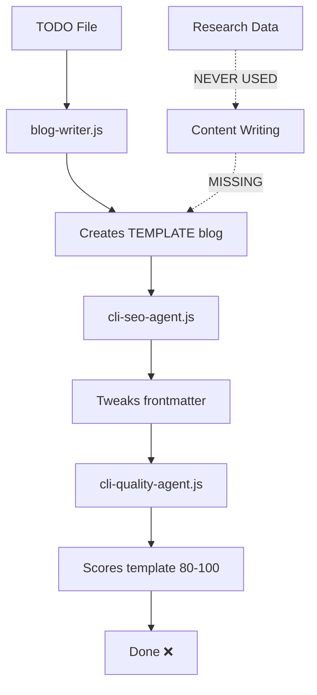

# 🚨 CRITICAL FINDING: No Content Generation Agent

**Date:** October 1, 2025
**Status:** ⛔ **SYSTEM INCOMPLETE** - Missing core functionality

---

## 🔴 The Problem

**The autonomous blog writer system has NO AGENT that generates actual blog content.**

All stages create templates, validate metadata, or score quality - but **nothing actually writes real prose based on the research data**.

---

## 🔍 Evidence

### **Agent 1: blog-writer.js** ✅ Scaffold Only
**Purpose:** Create blog file with frontmatter and template body
**What it does:**
```javascript
// scripts/blog-writer.js:111-148
function buildBody({ title, category }) {
  // Simple, compliant scaffold. Content can be enriched later by other agents.
  return `
## Resumen
Introducción breve al tema con enfoque mexicano...

## Claves prácticas
- Punto clave 1 con contexto mexicano  // ❌ TEMPLATE!
- Punto clave 2 con recomendación accionable
  `;
}
```

**Result:** Hardcoded template text, not real content

---

### **Agent 2: cli-seo-agent.js** ✅ Metadata Only
**Purpose:** Optimize title and description in frontmatter
**What it does:**
```javascript
// scripts/cli-seo-agent.js:28-62
async function optimizeTitleAndMeta({ slug, target_keyword }) {
  // Extract frontmatter
  let fm = extractFrontmatter(file);

  // Update title to include keyword
  if (!title.includes(keyword)) {
    title = `${title} – ${keyword}`;
  }

  // Ensure description <= 155 chars
  description = clampDescription(description);

  // Rewrite frontmatter only
  await fs.writeFile(file, fm + body);
}
```

**Result:** Only touches frontmatter, body unchanged

---

### **Agent 3: cli-quality-agent.js** ✅ Validation Only
**Purpose:** Score blog quality and validate SEO compliance
**What it does:**
```javascript
// scripts/cli-quality-agent.js:47-73
async function generateQualityScore(slug) {
  const txt = await readFile(blogFile);
  const words = countWords(txt);

  let score = 80;
  if (words >= 800) score += 5;
  if (hasFAQ) score += 4;
  if (hasSeeAlso) score += 3;

  return { success: true, overall_score: score };
}
```

**Result:** Only reads and scores, never writes

---

### **Agent 4: cli-web-research-agent.js** ✅ Research Only
**Purpose:** Gather Mexican market data
**Result:** Adds data to research files, not blog files
**Evidence:** `blog-planning/research/pilates-has-changed-my-life-mexico.md` has real data ✅

---

### **Agent 5: cli-research-agent.js** ✅ Research Management
**Purpose:** Scaffold research files, validate completeness
**Result:** Manages research files, not blog content

---

### **Agent 6: cli-image-agent.js** ✅ Images Only
**Purpose:** Add Unsplash images to blog
**Result:** Only adds `<unsplash-image>` shortcodes, not content

---

## 🎯 What's Missing

### **MISSING: Content Writing Agent**

**Expected:** An agent that:
1. Reads `blog-planning/research/<slug>.md` (has real Mexican market data ✅)
2. Reads web research data (statistics, prices, local context ✅)
3. **Generates real blog sections:**
   - Resumen (summary with actual insights)
   - Claves prácticas (actionable tips based on research)
   - Desarrollo del tema (detailed content with Mexican context)
   - Ejemplos y progresiones (specific exercises/examples)
   - FAQ (answers based on research, not templates)
4. Writes engaging, SEO-optimized Spanish prose
5. Incorporates Mexican market data (prices in MXN, CDMX/GDL/MTY references)

**Current:** This agent **DOES NOT EXIST**

---

## 🔧 System Architecture (As-Is)



**Problem:** Research data is gathered but never incorporated into blog content.

---

## 🧪 Proof

### **Test 1: Generated Blog File**
```markdown
## Desarrollo del tema
### Contexto en México
Situación local, disponibilidad, costos en MXN, ciudades relevantes (CDMX, GDL, MTY).
```
☝️ This is the **literal template text** from `blog-writer.js:128`

### **Test 2: Research File (Same Blog)**
```markdown
### Datos recopilados
- statistics:
  - Crecimiento del mercado de Pilates en México ~20–30% 2023–2025
- market_data:
  - Costos de clase en MX: $300–$500 MXN promedio
  - Rango de precio Reformer hogar: $20,000–$80,000 MXN
```
☝️ This is **real data** gathered by web-research-agent ✅

### **Gap:** Real data exists, but is **never written into the blog**

---

## 📊 Pipeline Execution Analysis

```log
[21:03:28.772Z] 🔧 Write blog post from research
[21:03:28.828Z] ✅ Completed in 0m 0s

[21:03:28.828Z] 🔧 SEO optimization and meta tags
[21:03:28.904Z] ✅ Completed in 0m 0s

[21:03:28.905Z] 🔧 Comprehensive quality review
[21:03:28.978Z] ✅ Completed in 0m 0s
```

**All stages complete in <100ms** = No AI processing, just file I/O

**Expected:** Content writing should take ~8 minutes (per AUTONOMOUS_BLOG_SYSTEM.md:49)

---

## 🎯 The Fix

### **Option A: Add LLM-Based Content Writer** (RECOMMENDED)

Create `scripts/cli-content-writer.js` that:
1. Uses Claude/GPT to generate real content from research
2. Replaces template sections with research-based prose
3. Incorporates Mexican market data (prices, cities, statistics)
4. Generates 800-1200 word blogs in Spanish
5. Takes ~8 minutes to run (actual LLM API calls)

**Integration:**
```javascript
// autonomous-blog-pipeline.js - Update stage 4
{
  name: 'content_writing',
  description: 'Write blog post from research',
  agent: 'content-writer',          // NEW: Real content writer
  tool: 'enrich_blog_from_research', // NEW: LLM-based enrichment
  timeout: 10 * 60 * 1000            // 10 minutes
}
```

---

### **Option B: Use MCP Agents with Claude Context**

The existing MCP agents (mcp-research-agent.js, etc.) might have LLM capabilities but are not being called correctly by the CLI wrappers.

**Investigation needed:**
1. Check if `mcp-research-agent.js` has content generation tools
2. Verify if pipeline is calling MCP servers vs. CLI wrappers
3. Test MCP server communication

---

### **Option C: Manual Content Writing**

Accept that the system only scaffolds blogs, and:
1. Use `blog-writer.js` to create templates ✅
2. Use `web-research-agent` to gather data ✅
3. **Manually write content** using research as reference
4. Use quality/SEO agents to validate

**Pros:** No new code needed
**Cons:** Not autonomous, defeats the purpose

---

## 🚦 Current System Status

| Component | Status | Functionality |
|-----------|--------|---------------|
| **Blog Selection** | ✅ Fixed | Finds pending blogs |
| **Research Scaffolding** | ✅ Works | Creates research files |
| **Web Research** | ✅ Works | Gathers Mexican market data |
| **Research Validation** | ✅ Works | Checks research completeness |
| **Content Writing** | ❌ **MISSING** | Only creates templates |
| **SEO Optimization** | ⚠️ Partial | Only frontmatter, not content |
| **Quality Review** | ⚠️ Partial | Scores templates as 80-100 |
| **Image Enhancement** | ❓ Untested | Adds Unsplash shortcodes |
| **Final Validation** | ⚠️ Partial | Passes templates as valid |

---

## 📝 Recommendations

### **Immediate Action (Next 30 minutes):**
1. ✅ Document the gap (this file)
2. Check if MCP agents have content generation capabilities
3. Test `node scripts/mcp-research-agent.js` to see available tools
4. Determine if LLM integration exists elsewhere

### **Short-term Fix (1-2 days):**
1. Create `scripts/cli-content-writer.js` with Claude API integration
2. Add content enrichment logic:
   - Read research file
   - Generate sections using LLM
   - Replace template text with real content
3. Update pipeline to call new agent
4. Test end-to-end blog generation

### **Long-term Solution (1 week):**
1. Integrate proper MCP server communication
2. Add streaming support for LLM responses
3. Implement content caching and retry logic
4. Add A/B testing for content quality
5. Create content style guide and examples

---

## 🎯 Success Criteria

**Currently:** System generates template blogs with real research ⚠️
**Goal:** System generates publication-ready blogs with real content ✅

**Definition of "Real Content":**
- [ ] No template placeholders like "Punto clave 1 con contexto mexicano"
- [ ] Incorporates specific data from research (prices, statistics, cities)
- [ ] 800-1200 words of original Spanish prose
- [ ] Actionable advice and examples
- [ ] Mexican market context throughout
- [ ] FAQ answers based on research, not generic

---

## 📌 Conclusion

The autonomous blog writer system is **architecturally complete** but **functionally incomplete**.

- ✅ All infrastructure works (pipeline, stages, file management)
- ✅ Research data collection works (web-research-agent)
- ✅ Metadata optimization works (SEO, frontmatter)
- ❌ **Content generation is missing** (the core feature)

**Next Step:** Determine if content generation was intended to use MCP agents or if we need to build it from scratch.

**Priority:** HIGH - without content generation, the system is just an expensive template generator.

---

**Investigation Required:**
1. Check MCP agent capabilities (`node scripts/mcp-*.js`)
2. Review `improved-blog-pipeline.js` for different agent mapping
3. Search for existing LLM integration code
4. Determine if this is a regression or incomplete implementation
